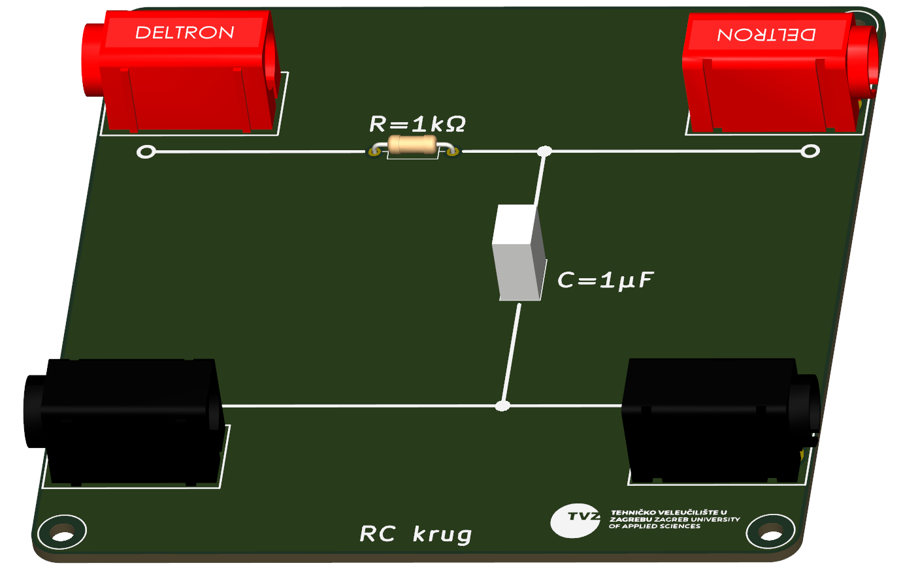

# Analog Control Systems Laboratory PCBs

A collection of educational printed circuit boards (PCBs) developed for laboratory exercises in **Automatic Control Systems**. The project demonstrates the implementation of fundamental analog transfer functions using passive components and operational amplifiers.

The boards are intended for university courses and provide a hands-on platform for studying the behavior of basic dynamic systems through practical experiments.

---

## Overview

This repository contains three independent laboratory boards:

| Board | Description |
|-------|-------------|
| **RC Network** | Passive first-order RC circuit for studying time constants, transient response, and frequency response. |
| **P / PT1 / DT1** | Active analog circuit implementing proportional (P), first-order lag (PT1), and derivative (DT1) transfer functions using operational amplifiers. |
| **PI / I Controller** | Active analog circuit implementing an integrator (I) and proportional-integral (PI) controller. |

---

## Features

- Educational design for laboratory use
- Through-hole components for easy assembly and maintenance
- Banana connector interface for convenient measurements
- Powered from ±12 V laboratory power supply
- Designed in KiCad
- Fully documented schematics and PCB layouts

---

## Boards

### 1. RC Network

A passive first-order RC circuit used to investigate:

- Step response
- Time constant
- Charging and discharging behavior
- Frequency response
- First-order transfer functions

---

### 2. P / PT1 / DT1 Board

An operational amplifier based circuit providing three selectable transfer functions:

- **P** – Proportional element
- **PT1** – First-order lag element
- **DT1** – Derivative element with first-order filtering

Jumper Configuration:
| Transfer Function | JP1 | JP2 |
|-------------------|-----|-----|
| **PT1** | Pins **2–3** | Pins **2–3** |
| **DT1** | Pins **1–2** | Pins **1–2** |
| **P** | Pins **2–3** | Pins **1–2** |

This board allows students to compare the behavior of different dynamic systems under identical experimental conditions.

---

### 3. PI / I Controller

An operational amplifier implementation of:

- **Integrator (I)**
- **Proportional–Integral (PI) controller**

Jumper Configuration:
| Transfer Function | JP1 |
|-------------------|:---:|
| **PI** | 1–2 |
| **I** | 2–3 |

The board is intended for experiments involving closed-loop control and controller tuning.

## Software

Designed using **KiCad**.

The repository includes:

- Schematics
- PCB layouts
- Gerber files
- Bill of Materials (BOM)
- Manufacturing files

---

## Applications

These boards are suitable for:

- Automatic Control Systems laboratories
- Analog Electronics courses
- Control Engineering education
- Demonstrations of transfer functions
- Experimental verification of theoretical models

---

## Future Improvements

Planned additions include:

- Laboratory manuals
- Example experiments
- Simulation models
- Oscilloscope measurements
- Bode plots
- Assembly instructions

---

## License

This project is released under the MIT License.

---

## Author

Designed and developed for educational use in Automatic Control Systems laboratories.
